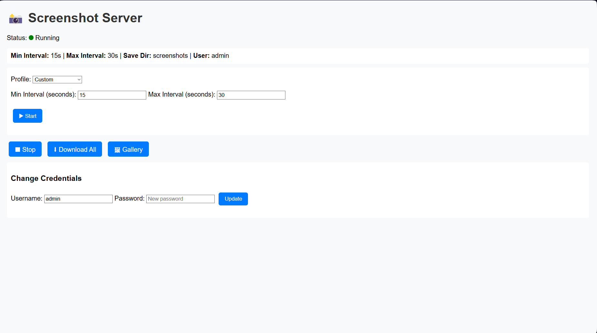

# 📸 CaptureHub

📸 Flask Screenshot Server – Web-based Automated Screen Capture Tool

**CaptureHub** is a simple web-based screenshot tool built with Flask and PyAutoGUI.
Start/stop automated screenshots, set intervals (Fast/Medium/Slow), view gallery, and download images—all from your browser.

**Installation & Run:**

```bash
git clone https://github.com/Kalyan-Deva/capturehub.git
cd capturehub
pip install -r requirements.txt
python app.py
```

Open `http://localhost:5000` and login (default: admin/password).

**Notes:**
Screenshots saved in `screenshots/`. `.gitignore` includes this folder and `server.log`.


---

